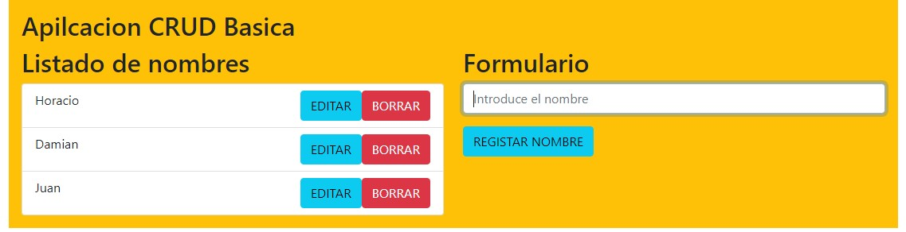

<h4>App de registro y listado de nombres hecha con  React Js</h4>

Instale en las dependencias Bootstrap(lo importe en el index.js para tenerlo disponible en todo el proyecto) y uniqid para generar id unicas para los nombres ,ya que para agregar un nombre nuevo lo puse en un objeto, cada objeto con su id unico y nombre.Asi a pesar de haber dos nombres iguales,React los reconocera como diferentes.

Agregue un componente para el formulario y este esta divido en dos ,una parte para registrar el nombre y otra para listarlo.Ambos los hice con Bootstrap.

Use el hook useState para manejar el estado de los nombres en el formulario y tambien para la lista de nombres.Utilize el evento onChange para vincular los nombres  del formulario y el evento onSubmit para capturar los nombres.</p<

Para mostar los nombres en la lista  use el metodo map para recorrer el arreglo con los nombres ,le puse el id  a la key y una funcion con un li con el nombre.

Para borrar los nombres registrados , use el metodo filter en el arreglo.En un boton con el evento onClick , con una funcion que tome el id y nombres singulares y elimine ese exactamente.

Para editar un nombre, a travez de useState ,con estado inicial falso (porque no se puede editar algo que no existe todavia),cree una variable que cambie el estado a verdadero y en un nuevo boton con el metodo onClick y una funcion con dos parametros un  id y nombre especifico.

Para comprobar que el campo nombre no esta vacio al registrar ,use una condicion en la que el negativo ! de nombre no se pueda rellenar y lo hice con el metodo trim y luego a travez de una alerta avisar del error.

-----
